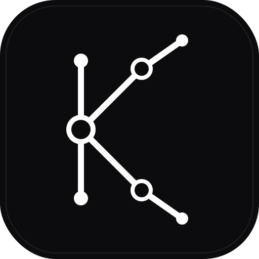

# kyro

# Kyro

  
  
    A lightweight language written in Rust
  

  
  
  

  

Kyro is a lightweight, toy programming language built in Rust, inspired by the [Lox language from Crafting Interpreters](https://craftinginterpreters.com/the-lox-language.html). It features a tree-walk interpreter architecture with modern enhancements such as a static resolution pass, compiled string interpolation, and a namespace-isolated standard library.

The language is designed for simplicity and extensibility, supporting object-oriented programming (OOP), structured exception handling, and first-class collection types like lists and dictionaries
